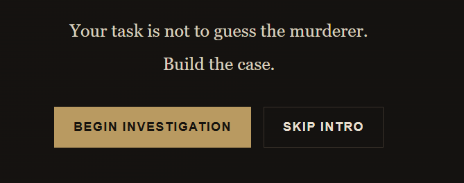
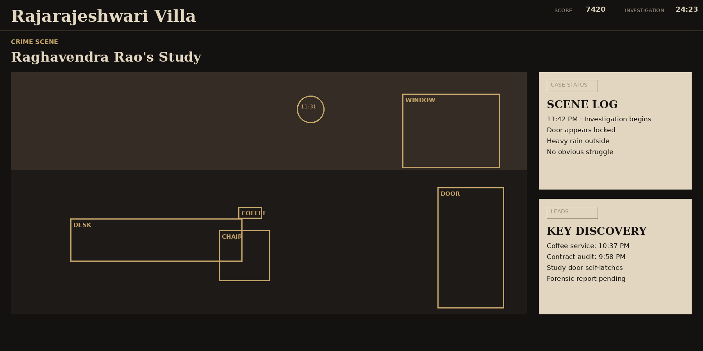
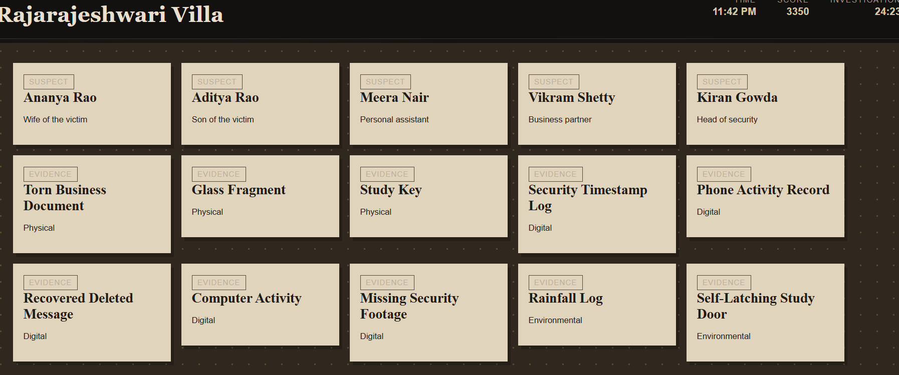
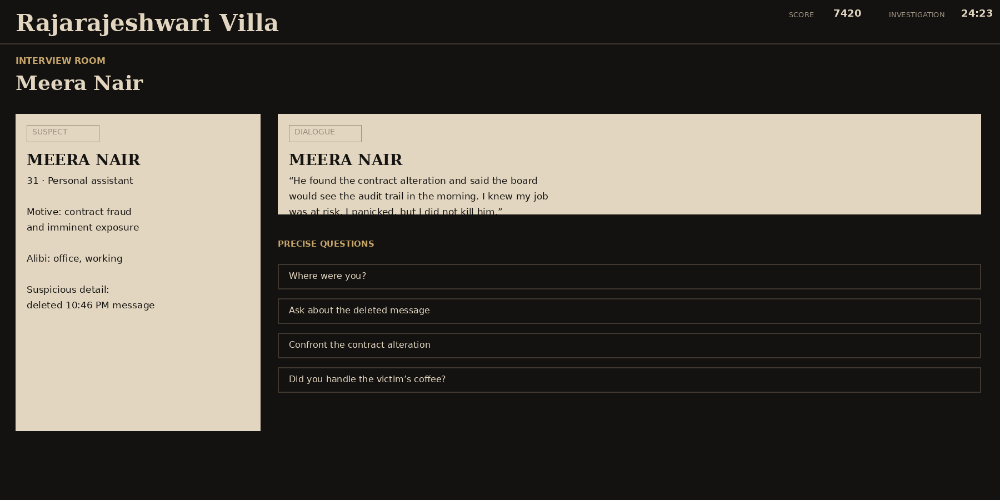
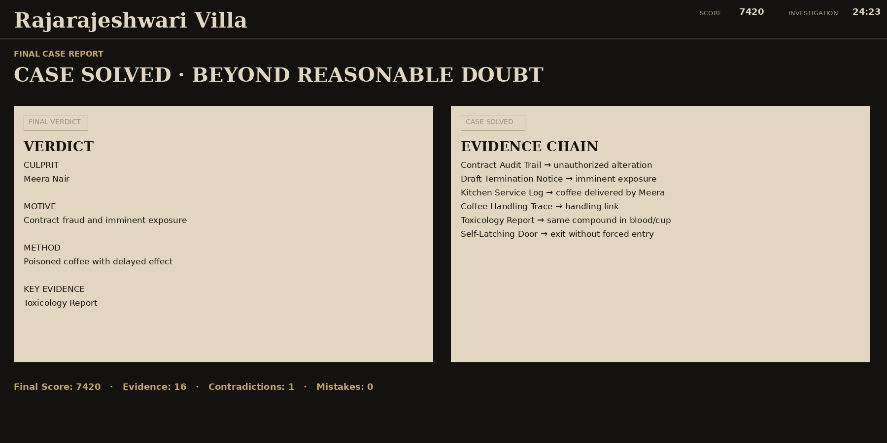

# The Detective Case: Rajarajeshwari Villa

A hard-level browser detective investigation game built entirely with HTML5, CSS3 and Vanilla JavaScript.

## Overview

Raghavendra Rao, a wealthy Bengaluru businessman, is found dead inside his private study at Rajarajeshwari Villa. The door appears locked. Five people have motives, alibis and suspicious details. The player is the detective and must establish a defensible chain of evidence.

## Features

- Interactive crime scene with clickable objects
- Evidence inventory with categories and search
- Five suspect interrogation system
- Progressive questions and contradiction mechanics
- Four investigation puzzles
- Reconstructable timeline with drag-free button controls
- Deduction board for evidence connections
- Local case notes
- Three-level hint system
- Persistent localStorage save system
- Investigation timer and scoring
- Multiple endings
- Responsive desktop/tablet/mobile layout
- Keyboard-accessible buttons and visible focus states
- Reduced-motion support
- ES6 module architecture

## Game Mechanics

The intended solution is built around a converging chain of independent evidence rather than a single clue. The player must connect Meera's documented contract fraud, Raghavendra's plan to expose and terminate her, the deleted 10:46 PM message, the coffee service record, forensic toxicology, the coffee-handling trace and the self-latching study door. The strongest evidence is deliberately split across documentary, testimonial and forensic sources so that no single clue is enough on its own.

The game deliberately includes red herrings:
- Ananya's coffee does not prove she entered the study.
- Aditya's Wi-Fi activity is compatible with the garage.
- Kiran's missing footage has a documented camera-fault explanation.
- Vikram's vehicle record creates a contradiction but does not by itself prove murder.

## Tech Stack

- HTML5
- CSS3
- Vanilla JavaScript ES6 modules
- Browser localStorage API

No framework, backend, database, Node.js runtime or game engine is required.

## Architecture

```text
detective-case/
├── index.html
├── css/
│   ├── style.css
│   ├── crime-scene.css
│   ├── evidence.css
│   ├── interrogation.css
│   ├── timeline.css
│   └── animations.css
├── js/
│   ├── main.js
│   ├── gameState.js
│   ├── evidence.js
│   ├── suspects.js
│   └── interrogation.js
│   ├── interrogation.js
│   ├── timeline.js
│   ├── puzzles.js
│   ├── deduction.js
│   ├── scoring.js
│   ├── storage.js
│   └── ui.js
├── assets/
└── README.md
```

`interrogation.js` provides the dedicated interrogation API while the underlying dialogue data remains in `suspects.js`.

## How to Run

1. Download or clone the repository.
2. Open `index.html` directly in a modern browser.
3. Chrome, Edge or Firefox are recommended.
4. No installation command is required.

If a browser configuration blocks local ES modules from `file://`, serve the folder with any simple static file server. The game itself still contains no backend.

## JavaScript Concepts Demonstrated

DOM manipulation, event delegation, arrays, nested objects, ES6 modules, JSON serialization, localStorage, timers, state management, conditional logic, dynamic rendering, forms, modals, data filtering and puzzle logic.

## Future Improvements

- Replace CSS-only scene illustration with custom SVG artwork
- Add optional ambient rain audio
- Add a true drag-and-drop timeline mode
- Add randomized secondary clues
- Add a richer case archive and replay statistics
- Add additional cases sharing the same game engine

## Screenshots

### Intro



### Crime Scene



### Evidence Board



### Interrogation View



### Final Case Report




## Visual / Interaction Upgrade

The crime-scene view has been redesigned as a cinematic interactive illustration. It now includes:

- Illustrated study elements: fireplace, bookshelf, painting, wall clock, desk, chair, lamp, telephone, coffee, glass and self-latching door
- Animated rain outside the window and atmospheric lighting
- Evidence-priority hotspot around the coffee cup
- Hover/focus feedback and keyboard-accessible scene objects
- Live scene status, evidence progress and field-note panel
- More visual depth through shadows, textures, wall panels, floorboards and vignette lighting
- Existing evidence, interrogation, timeline, deduction and save functionality preserved
